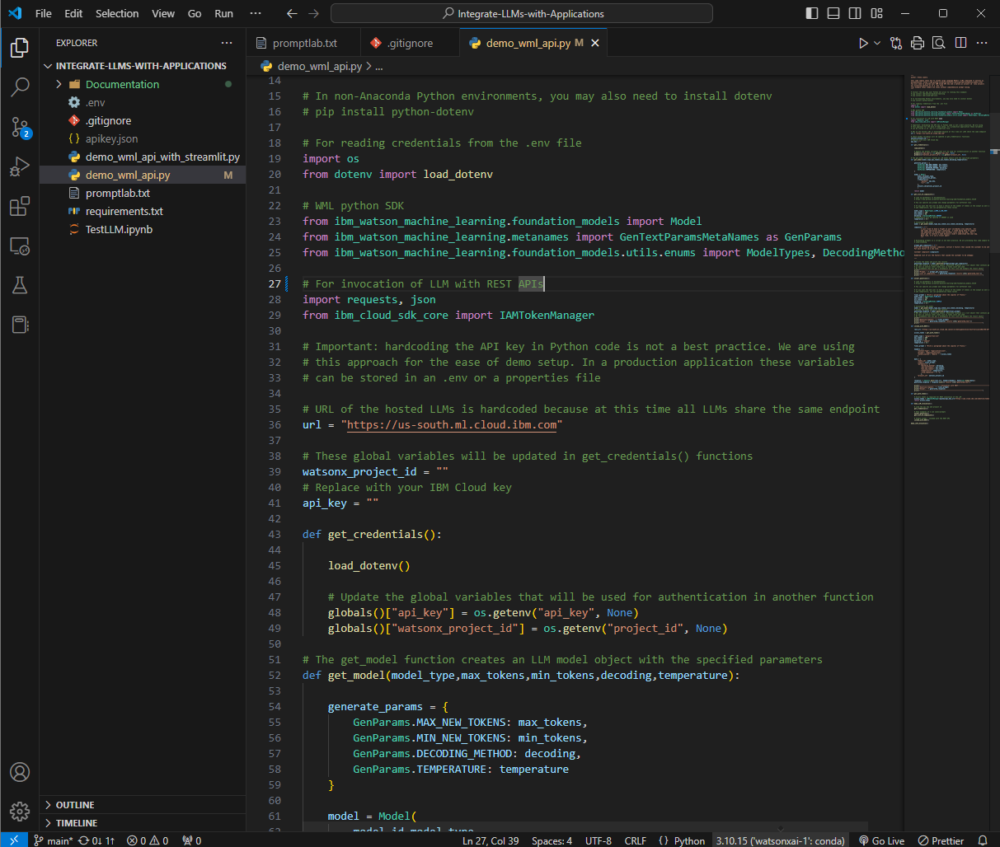
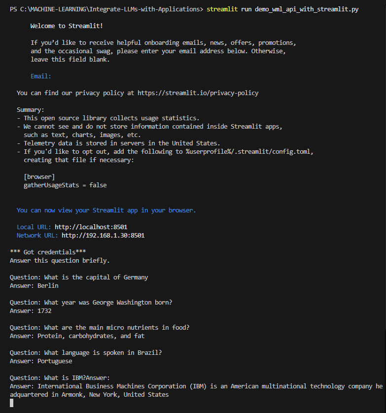

<h1 align="center"> Watsonx.AI Integrate LLMs with Applications 🤖✨ </h1>

This repository demonstrates the integration of IBM WatsonX.ai Large Language Models (LLMs) with applications, showcasing various use cases such as customer complaint analysis, question answering, and interactive web interfaces using Streamlit.

  
  
  
  
  

<h2>Content Overview 📚</h2>
<ol>
  <li>
    <strong>Demo WatsonX API Integration (<a href="https://github.com/valselt/WatsonX.AI-Integrate_LLMs_with_Applications/blob/main/demo_wml_api.py">demo_wml_api.py</a>) 🌐</strong> - 
    Demonstrates how to integrate and invoke IBM WatsonX.ai Large Language Models (LLMs) through Python. Includes examples of:
    <ul>
      <li>Extracting key factors from customer complaints using predefined prompts.</li>
      <li>Answering general knowledge questions with dynamic model parameters like decoding methods and token limits.</li>
      <li>Utilizing REST API for LLM invocation with detailed configuration for prompts and responses.</li>
    </ul>
  </li>
  <li>
    <strong>Interactive WatsonX Streamlit Application (<a href="https://github.com/valselt/WatsonX.AI-Integrate_LLMs_with_Applications/blob/main/demo_wml_api_with_streamlit.py">demo_wml_api_with_streamlit.py</a>) 💻</strong> - 
    Showcases a web-based interface using Streamlit to interact with WatsonX.ai LLMs. Features include:
    <ul>
      <li>Building dynamic prompts with user-provided questions and contextual examples.</li>
      <li>Real-time interaction with LLMs for text generation and question answering.</li>
      <li>Streamlined UI for asking questions, clearing inputs, and displaying model responses.</li>
    </ul>
  </li>
</ol>

<h2>Setup ⚙️</h2>

<h3>
  

    With Anaconda
        
  

</h3>

<ol>
    <li><a href ="https://github.com/valselt/valselt/blob/main/tutorial/conda-env/watsonxai-1.yaml">(Option 1) Use the valselt's Anaconda Configuration</a></li>
    <li><a href ="https://github.com/valselt/valselt/blob/main/tutorial/setup/watsonxai-1/option2.md">(Option 2) Build it Yourself</a></li>
</ol>

<h2>How to Run 🚀</h2>
<ol>
  <li>Download the .py file
        <ul>
            <li>
                demo_wml_api.py 
                <a href="https://github.com/ibm-build-lab/VAD-VAR-Workshop/blob/main/content/labs/Watsonx/WatsonxAI/files/201/applications/demo_wml_api.py" style="padding: 1px 5px; background-color: #007bff; color: white; text-decoration: none; border-radius: 8px; margin-right: 4px;">Original from IBM</a>
                <a href="https://github.com/valselt/WatsonX.AI-Integrate_LLMs_with_Applications/blob/main/demo_wml_api.py" style="padding: 1px 5px; background-color: #28a745; color: white; text-decoration: none; border-radius: 8px;">Valselt</a>
            </li>
            <li>
                demo_wml_api_with_streamlit.py 
                <a href="https://github.com/ibm-build-lab/VAD-VAR-Workshop/blob/main/content/labs/Watsonx/WatsonxAI/files/201/applications/demo_wml_api_with_streamlit.py" style="padding: 1px 5px; background-color: #007bff; color: white; text-decoration: none; border-radius: 8px; margin-right: 4px;">Original from IBM</a> 
                <a href="https://github.com/valselt/WatsonX.AI-Integrate_LLMs_with_Applications/blob/main/demo_wml_api_with_streamlit.py" style="padding: 1px 5px; background-color: #28a745; color: white; text-decoration: none; border-radius: 8px;">Valselt</a>
            </li>
            <li></li>
        </ul>
  </li>
  <li>
    <strong>Run the API Demo Script:</strong> Execute the following command to run the WatsonX.ai API demo script:
    <pre><code>python ./demo_wml_api.py</code></pre>
    
  </li>
  <li>
    <strong>Run the Streamlit Application:</strong> Start the interactive web interface by running:
    <pre><code>streamlit run demo_wml_api_with_streamlit.py</code></pre>
    
  </li>
</ol>
